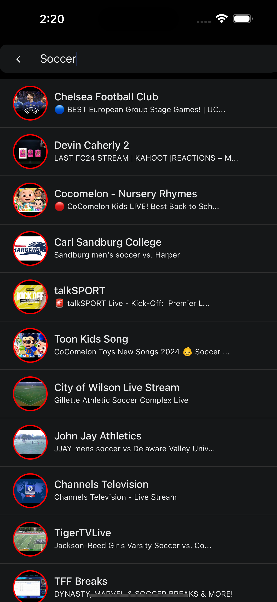

# TubeTV

A learning purpose mobile application built for personal use only. My father who used to watch news on youtube told me about the hassle of getting live News TV channels so I thought about to make a mobile application where all live news channels will be listed and searchable. Only react-native expo has been used to build with vanilla style.

## How to use

- Download the APK file from [here](https://expo.dev/artifacts/eas/o4gCR5o7UWUv7Sq2s3JFQZ.apk)
- Install the APK file
- Use the application

### Features

